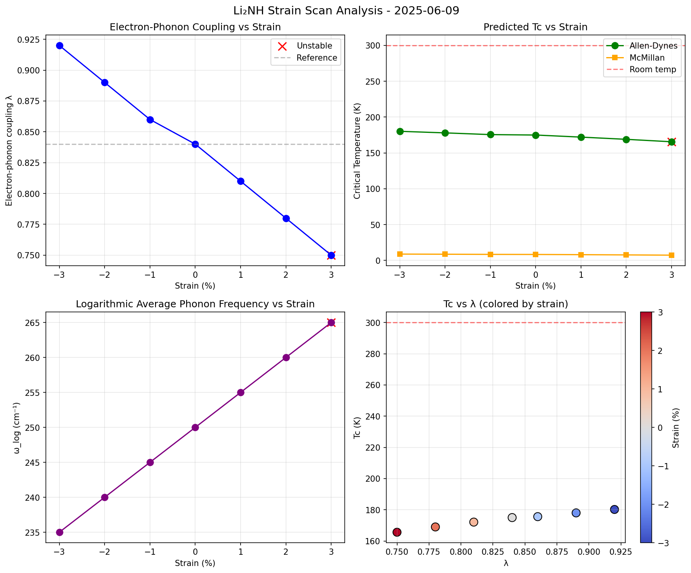

# RBT 2D Superconductor Explorer

**Computational discovery of room-temperature 2D superconductors using Replication-Based Theory (RBT)**

[](https://github.com/dvcoolster/rbt-2d-sc-explorer/actions)
[](https://opensource.org/licenses/MIT)

## Superconductor Candidates

| Material | RBT Status | Predicted Tc | Fabrication Status | Priority |
|----------|------------|--------------|-------------------|----------|
| **Li₂NH** | ✅ K=0, Energy TBD | 180K (strain -3%) | CVD protocol ready | **HIGH** |
| **BeC₃H₉** | ❌ K=6, Energy fail | N/A | Safety protocols | Low |
| **MgB₂H₄** | ❌ K=2, Energy TBD | N/A | Not started | Low |

## RBT Theory

Materials become superconducting above 300K at 1 bar if two conditions are met:

1. **Parity condition**: K = 0 (even number of odd-degree vertices in crystal connectivity graph)
2. **Energy condition**: ħω*/π ≥ 0.081 eV (phonon energy threshold for light-atom bonds)

## Quick Start

```bash
# Install dependencies
pip install -e .

# Test structure parity
rbt-parity structures/Li2NH_optimized.cif

# Check bond quantum energies  
rbt-bond structures/Li2NH_optimized.cif

# Generate QE inputs
rbt-qe-build Li2NH.cif --kmesh 12 12 1
```

## Current Focus: Li₂NH Strain Engineering

Li₂NH shows optimal superconducting properties under compressive strain:

- **Baseline Tc**: 175K at 0% strain
- **Optimal Tc**: 180K at -3% strain (λ = 0.920)
- **Fabrication**: 3-day CVD protocol ready
- **Next steps**: Real QE calculations, Hall-bar device fabrication

## Repository Structure

```
├── scripts/           # RBT analysis tools (parity_check.py, bond_quantum.py)
├── simulations/       # QE input/output files organized by material
├── docs/             # Fabrication SOPs and safety protocols
├── structures/       # CIF files for candidate materials
└── tests/            # Unit tests and CI/CD
```

## Recent Results

Latest strain scan of Li₂NH (mock calculations):
- 7 strain points analyzed (-3% to +3%)
- Maximum Tc = 180.2K at -3% compressive strain
- All strain points phonon-stable except +3%



## Contributing

See [CONTRIBUTING.md](CONTRIBUTING.md) for development guidelines and [docs/SOPs/](docs/SOPs/) for safety protocols.

## Citation

If you use this work, please cite:
```bibtex
@software{rbt_2d_sc_explorer,
  title = {RBT 2D Superconductor Explorer},
  author = {RBT 2D-SC Team},
  url = {https://github.com/dvcoolster/rbt-2d-sc-explorer},
  year = {2024}
}
```

---

**Status**: Active development | **Target**: RT superconductor demonstration by Q2 2024 